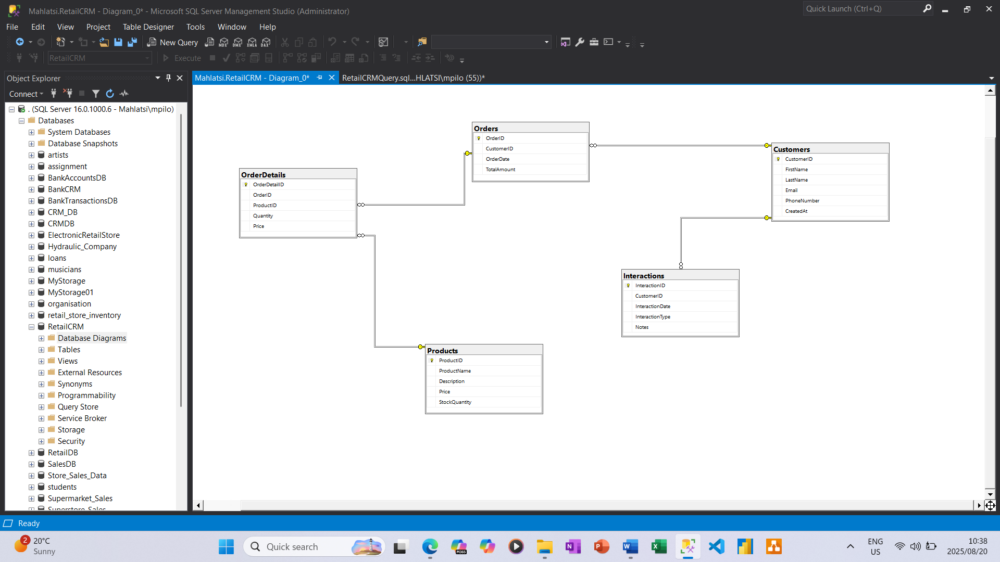

# Retail Store Customer Management System

## Problem Statement
>"As a retail store manager, I want a comprehensive system to manage and track my customers, their purchases, and interactions with the store. By having centralized and organized customer data, I can gain insights into buying behavior, track transaction histories, and understand engagement patterns. This will allow me to make data-driven decisions, manage customer information efficiently, and deliver personalized services or targeted promotions that improve customer satisfaction, loyalty, and overall sales performance."

## Data Model Screenshot
  

## Project Overview
This project simulates a **Retail CRM system** that allows store managers to track customers, their purchases, and interactions. It demonstrates the use of relational databases, SQL queries, and data management techniques to organize and analyze retail data.

## Key Features
- Track customer details and purchase history  
- Manage store interactions and engagement  
- Generate insights to improve personalized services and promotions  
- Simulated data for testing and analysis  

## Project Files
- `RetailCRMQuery.sql` – SQL script containing database creation, table definitions, and sample queries  
- `RetailCRMDataModel.png` – Visual Representation on the database 

## Tasks and Tools
- **Database Design:** Created a relational database schema using **Data Definition Language (DDL)** to define tables, primary keys, and relationships  
- **Data Population:** Inserted 50 sample records (10 per table) to simulate realistic customer, purchase, and interaction data  
- **Data Interaction:** Used **Data Manipulation Language (DML)** to insert, update, delete, and query data for testing and analysis  
- **Analysis & Testing:** Validated data integrity and relationships, and tested queries to retrieve meaningful insights  

## Technologies Used
- T-SQL  
- SQL (DDL & DML)  
- SQL Server Management Studio
